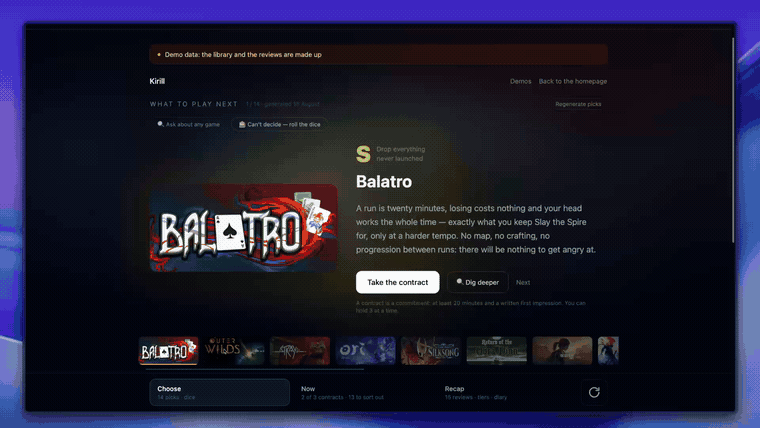

# Curio

**A journal of what you've played that turns into advice on what to play next.**

Curio connects to your Steam library and asks you to write not one review after
you finish a game, but several along the way — whenever your opinion moves. Write
after the first evening, or forty hours in, or the moment a game loses you; there
are no checkpoints to hit. Every entry is automatically stamped with your real
playtime from Steam, so you can see how your opinion changed, not just how it
ended up.

Those entries add up to a taste profile — what irritates you game after game,
what hooks you, where your score disagrees with the way you actually talk about
a game. The advice is built on that profile: your unplayed games get sorted into
tiers with links back to your own words, and any single game can be put through
a deep dive over its Steam reviews.



*Recorded in demo mode — the library and the diary belong to a made-up player.
You can [walk through the same thing](https://curio.brainy.run/try) without an
account.*

## How it works

1. **You bring your own model key.** Curio doesn't pay for inference — the key
   is yours, and requests go straight to the provider you picked.
2. **You fill the journal.** Import the reviews from your Steam profile with one
   button, write about what you've played by hand, or spin the roulette — it
   picks a random game from the backlog and opens a slot for it.
3. **You get the write-ups.** A taste profile, a tier list of what's unplayed,
   verdicts on individual games, and a chronicle of what you actually played and
   when.

A review in Curio is a thread, not a snapshot:

```
First impression · 45 min
  "The combat is interesting, the art is nice..."

Update · 4 h 20 min
  "The story is starting to sag, but the side quests save it..."

Verdict · 12 h · Finished · 4/5
  "Glad I stuck with it, the ending is strong..."
```

## Stack

Astro 6 (SSR, node adapter) · React 19 · Tailwind CSS 4 · PostgreSQL with
Drizzle ORM · Steam Web API · Steam OpenID login.

## Running locally

You need Node.js 22.12 or newer and a live PostgreSQL database.

```sh
npm install
cp .env.example .env   # fill in the variables from the table below
npm run db:push        # push the schema to the database
npm run dev
```

The app comes up on `http://localhost:4321`. Login goes through Steam OpenID, so
`STEAM_API_KEY` is needed from the very first minute — without it there's no way
to sign in.

### Environment variables

| Variable | Req. | What it is |
|---|---|---|
| `STEAM_API_KEY` | yes | Steam Web API key, get one at https://steamcommunity.com/dev/apikey |
| `SESSION_SECRET` | yes | random string, at least 32 characters; the session cookie is signed with it |
| `DATABASE_URL` | yes | PostgreSQL connection string |
| `ENCRYPTION_KEY` | yes | any random string, at least 24 characters — encrypts users' model keys. Never change it |
| `CRON_SECRET` | no | password for `/api/cron/poll`; without it the playtime tracker doesn't run |
| `DEV_ACCOUNTS_ENABLED` | no | enables test accounts, off by default |
| `DEV_STEAM_IDS` | no | comma-separated SteamIDs allowed to use test accounts |

`ENCRYPTION_KEY` is the one value in the project you can neither lose nor
change. The AES key is derived from it with HKDF, so any sufficiently long
random string will do — `openssl rand -base64 32` is a convenient way to get
one, not a requirement. But the derivation is deterministic: a different string
derives a different key, and every model key already in the database stops
decrypting. Save it somewhere outside the server and carry the same value across
every redeploy, or everyone using your copy has to enter their key again.

## Deploying your own copy

One thing is on you no matter which route you take: **the Steam key**. Valve
issues those to people, not to scripts — go to
https://steamcommunity.com/dev/apikey, put in any domain you like, and copy the
key out. Everything else the platform can do for you: `SESSION_SECRET`,
`ENCRYPTION_KEY` and `CRON_SECRET` are just long random strings, and the
database hands over its own address.

There are no migration files in this repository on purpose — the schema is
applied with `drizzle-kit push`, which compares the live database against
`src/db/schema.ts` and adds what's missing. Every route below runs it before the
server starts, so a fresh database doesn't stay empty. Re-running it costs
nothing; if a future schema change would destroy data, push refuses instead and
the app doesn't start until you deal with it by hand.

### Render

[](https://render.com/deploy?repo=https://github.com/klchdev/curio)

The button reads [`render.yaml`](render.yaml) and creates the web service and a
PostgreSQL next to it. Two clicks, not one: the first opens the blueprint, then
Render asks for `STEAM_API_KEY` and you press Apply.

Once it's up, copy `ENCRYPTION_KEY` out of the service's environment page and
keep it somewhere else. Render generated it and Render will happily generate a
different one if the service is ever recreated — and a different one can't
decrypt the model keys already in your database.

The free plan is a fair place to look around and a bad place to keep a journal:
the database is deleted after 30 days, and a free web service falls asleep when
nobody visits — and a sleeping process polls nothing, so the playtime tracker
stops recording. Both go away on a paid plan.

### Railway

Create a project from your fork at [railway.com/new](https://railway.com/new),
then add a PostgreSQL to it from the same canvas. Railway picks up
[`railway.json`](railway.json), builds the `Dockerfile` and starts the server —
no guessing at what the project is. Set the variables on the service:

| Variable | Value |
|---|---|
| `DATABASE_URL` | `${{Postgres.DATABASE_URL}}` — a reference to the database you just added |
| `STEAM_API_KEY` | yours from Valve |
| `SESSION_SECRET` | any long random string |
| `ENCRYPTION_KEY` | the same, and never change it afterwards |
| `CRON_SECRET` | the same; without it the tracker doesn't run |

Keep it at one replica — see [the tracker section](#playtime-tracker) for why.

### Docker Compose

On any machine with Docker, this is the whole thing — the app, a PostgreSQL, a
volume for it, and a one-shot job that puts the schema in place before the app
is let anywhere near it:

```sh
cp .env.example .env   # fill in STEAM_API_KEY and make up the secrets
docker compose up -d
```

`http://localhost:4321`. `DATABASE_URL` is set inside
[`docker-compose.yml`](docker-compose.yml) and ignored from `.env` — the
database is the `db` container, and a local development `.env` pointing at
localhost shouldn't be able to quietly break it.

To generate the secrets:

```sh
openssl rand -base64 32
```

Logs are `docker compose logs -f app`; if the app never comes up, look at
`docker compose logs schema` first — that's where a database that refused the
schema will say so.

### Just the image

The [`Dockerfile`](Dockerfile) is a plain multi-stage build with nothing
platform-specific in it, so it works anywhere a container does. It needs
`HOST=0.0.0.0` (already set), a `PORT`, and the variables from the table above.
The schema is applied by the image too:

```sh
docker run --rm -e DATABASE_URL=... your-image npm run db:push
```

## Model key (BYOK)

The write-ups, the advice and the verdicts come from a language model, and
everyone pays for their own. Curio keeps no shared key: you enter yours in the
settings, it gets encrypted (AES-256-GCM), and that encrypted form is the only
one the database ever holds.

Three providers are supported:

- **Google Gemini** — https://aistudio.google.com/apikey
- **Anthropic Claude** — https://console.anthropic.com/settings/keys
- **OpenAI** — https://platform.openai.com/api-keys

Gemini has a free tier, and it's enough to try everything except running a large
journal through analysis in one go. Do keep in mind that on the free tier Google
reserves the right to use the contents of your requests to improve its models;
the details are in [PRIVACY.md](docs/PRIVACY.md).

## Playtime tracker

Steam doesn't hand out history by day and hour: `playtime_forever` is a single
cumulative counter, and nothing that happened between two syncs can be recovered
from it. Curio builds that history itself, off two signals:

| Signal | Source | How often | What it gives |
|---|---|---|---|
| Minute counter | `GetRecentlyPlayedGames` | 30 min | `playtime_snapshots` — how much was played, down to the minute |
| "Playing right now" | `GetPlayerSummaries` | 3 min | `play_sessions` — exactly when, down to the clock |

On their own they're useless: the counter updates in jumps (often only when you
quit the game), and the status knows nothing about minutes. Together they add up
to "Tuesday, 21:04 to 23:40, two hours forty". The `/chrono` page turns that into
an hourly heatmap, days, top games and recent sessions.

Both polls run on timers inside the web process and are woken when the container
starts (`scripts/start.mjs` pings `/api/cron/poll`). What production needs:

- the `CRON_SECRET` variable — without it the tracker doesn't start;
- **don't let the service sleep**: a sleeping process polls nothing;
- a single replica. Several won't double-count (the increment is computed under
  a row lock, in the same transaction that writes the new value), but the number
  of requests to Valve grows with every one of them.

The same endpoint can be called from outside if you'd rather not keep the
process alive:

```sh
curl -H "authorization: Bearer $CRON_SECRET" "https://<app>/api/cron/poll?job=all"
```

What the tracker can't do: see a player with a private profile or in invisible
mode — for them only the counter readings survive, with no session boundaries.

### History from before the tracker

Some of the past can still be recovered — from the journal. Every entry is
stamped with an absolute playtime and a date, so two entries about the same game
give you an interval: "127 minutes played between May 3rd and May 12th".

```sh
DATABASE_URL=... npx tsx scripts/backfill-playtime-history.ts          # dry run
DATABASE_URL=... npx tsx scripts/backfill-playtime-history.ts --apply
```

Those rows are marked `source='backfill'` and stay out of the heatmap: the hour
in them is unknown, the average interval is nine days, and spreading it across
the day would mean inventing it.

## Privacy

What is stored, where it goes and how to delete all of it — in
[PRIVACY.md](docs/PRIVACY.md).

## Contributing

Bugs and ideas go to issues, patches to pull requests. Details in
[CONTRIBUTING.md](.github/CONTRIBUTING.md).

## License

MIT — see [LICENSE](LICENSE).

## Support

Curio is not a business. If it turned out to be useful, there's
[GitHub Sponsors](https://github.com/sponsors/klchdev) — it covers the hosting
and the domain, and that's all it does. Nothing is locked behind it: there is no
paid tier, no sponsor-only feature, and the hosted instance works the same
whether you give anything or not. The code is MIT, so the other way to support
it is a fork or a patch.

---

> **Not affiliated with Valve Corporation.**
> Steam and the Steam logo are trademarks of Valve Corporation.
